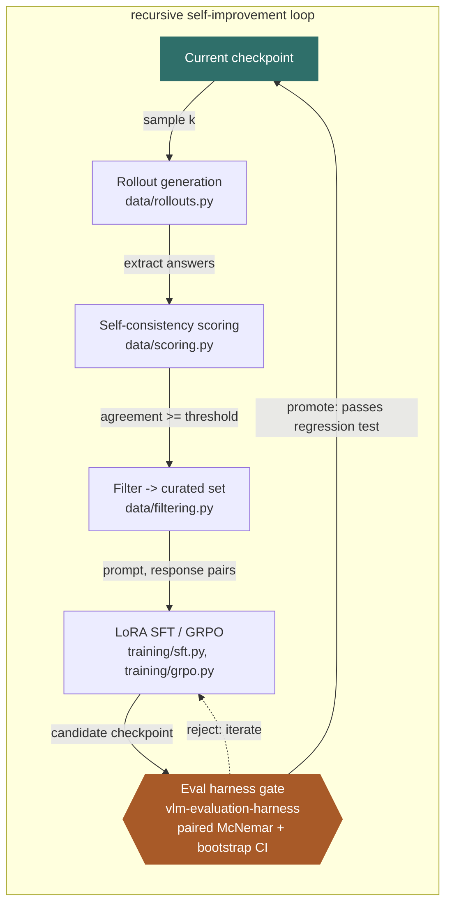

# SelfSight

Self-improving post-training and evaluation for vision-language models (VLMs).

## Idea

Close the loop between a VLM's outputs and its own training signal: generate,
score/verify, and filter model rollouts on multimodal tasks, then use that
curated data for further post-training (SFT / RL). Evaluation harnesses track
whether each iteration actually improves the model, not just fits the loop.

Promotion of a candidate checkpoint back into the "current" slot is gated by
[vlm-evaluation-harness](https://github.com/OnePunchMonk/vlm-evaluation-harness)
on a held-out benchmark set, via a paired-significance regression test rather
than a threshold on aggregate score deltas — this is what keeps the loop
honest as a recursive self-improvement (RSI) system: the eval gate never
shares code with the in-loop self-consistency scorer it's checking.

## The loop



The gate is architecturally independent from the in-loop scorer on purpose —
self-consistency voting decides what data trains the candidate, but only
the separate eval harness (a different repo, a different held-out benchmark
set, a different metric) decides whether the candidate replaces the current
checkpoint. Without that separation, a self-consistency-only loop can
converge on confident-and-wrong answers instead of genuine improvement.
Full RSI safety scope, now built: reward-hacking/diversity-collapse
detection (`data/diversity.py` — normalized Shannon entropy of each
group's vote distribution, tracked run over run, flags rising agreement
paired with falling diversity), a hard iteration cap with a human
checkpoint (`training/loop.py` — refuses to advance past the cap, or to
train on a collapse-flagged rollout set, without an explicit override),
and per-iteration capability-delta logging via the eval harness's own
tracked history. `train_benchmark` and `eval_benchmark` staying different
manifests is the frozen-eval-set half of the rule.

## Layout

```
selfsight/
  data/        # rollout generation, self-consistency scoring, filtering, diversity tracking — built
  training/    # LoRA SFT, GRPO, checkpoint merging, and the phase-4 loop orchestrator — built
  eval/        # delegates to vlm-evaluation-harness (separate repo, the promotion gate)
  configs/     # per-iteration training recipes + loop configs
  infra/       # Modal app for rollout generation, training, real eval, and the gate check
```

## Quickstart

```bash
pip install -e ".[dev,training]"
pytest tests/ -q

# phase 1: rollout -> self-consistency score -> filter (offline, mock adapter)
# --scored-output dumps every rollout (not just the SFT-filtered majority
# ones), which phase 3's GRPO needs. --metrics-output tracks mean
# agreement/diversity across runs and flags a reward-hacking collapse.
python -m data.cli --model mock:demo-v1 --benchmark demo_mc --k 5 \
    --min-agreement 0.6 --output curated.jsonl --scored-output scored.jsonl \
    --metrics-output metrics.jsonl

# phase 2: LoRA SFT over the curated set
python -m training.cli --config configs/sft_qwen2vl.yaml

# phase 3: GRPO over the scored (unfiltered) rollouts
python -m training.grpo_cli --config configs/grpo_internvl.yaml

# phase 4: advance the automated loop by exactly one iteration -- refuses
# to run past the RSI iteration cap or on a collapse-flagged rollout set
# without an explicit --override-cap / --override-collapse
python -m training.loop_cli --config configs/loop_internvl.yaml
```

All four steps also run on [Modal](https://modal.com) (`infra/modal_app.py`),
pinned to an L4 GPU — no A100/H100 for this phase's model size:

```bash
modal run infra/modal_app.py::generate_rollouts --model mock:demo-v1 --benchmark demo_mc
modal run infra/modal_app.py::train_sft --config configs/sft_qwen2vl.yaml
modal run infra/modal_app.py::train_grpo --config configs/grpo_internvl.yaml
modal run infra/modal_app.py::eval_model --model hf:OpenGVLab/InternVL3-2B-hf --bench SpatialCount
modal run infra/modal_app.py::check_regression --baseline hf:OpenGVLab/InternVL3-2B-hf \
    --current hf:/data/checkpoints/candidate-demo --bench SpatialCount
```

## Status

All four phases are built, and the full loop has run for real end to end on
a Modal L4 GPU with zero mocks in the chain: `InternVL3-2B-hf` sampled its
own rollouts on `demo_mc` (self-consistency scored, mean agreement 1.0 —
already confident on this easy benchmark), LoRA SFT'd on its own outputs,
merged into a standalone checkpoint, evaluated for real on the held-out
`SpatialCount` benchmark (87.5%, unchanged), and cleared the
paired-McNemar promotion gate with no flagged regressions. Phase 3 (GRPO,
group-relative advantage over self-consistency reward, optional KL via
LoRA's `disable_adapter`) also completed a real training run. Phase 4
(`training/loop.py`) automates one iteration at a time, bounded by the RSI
hard iteration cap and a reward-hacking/diversity-collapse check
(`data/diversity.py`) — both require an explicit override to bypass, never
a config default.

Four framework-level bugs surfaced along the way, none in this repo's own
logic: Qwen2-VL-2B-Instruct ([#1](https://github.com/OnePunchMonk/selfsight/issues/1))
and LLaVA-1.6-Mistral-7B ([#2](https://github.com/OnePunchMonk/selfsight/issues/2))
both crash in their vision-input handling under the available `transformers`
versions and remain unfixed (InternVL works, so they're not blocking); a
`GRPOTrainer.compute_loss` self-binding bug ([#3](https://github.com/OnePunchMonk/selfsight/issues/3))
was found and fixed same-day; and a merged-checkpoint image-token-accounting
bug specific to InternVL ([#4](https://github.com/OnePunchMonk/selfsight/issues/4))
was routed around by copying the base model's original tokenizer/processor
files (`training/checkpoint.py`) instead of re-serializing them.

What's still open: real (larger-scale) rollout generation beyond the demo
size, and wiring phase 4's loop orchestrator to actually run multiple
iterations in sequence (built and unit-tested, not yet run live for more
than one iteration).

## License

MIT
