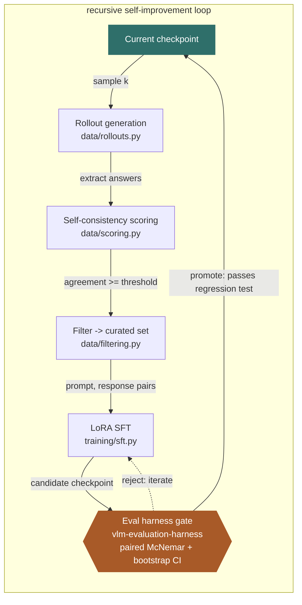

# SelfSight

Self-improving post-training and evaluation for vision-language models (VLMs).

## Idea

Close the loop between a VLM's outputs and its own training signal: generate,
score/verify, and filter model rollouts on multimodal tasks, then use that
curated data for further post-training (SFT / RL). Evaluation harnesses track
whether each iteration actually improves the model, not just fits the loop.

Promotion of a candidate checkpoint back into the "current" slot is gated by
[vlm-evaluation-harness](https://github.com/OnePunchMonk/vlm-evaluation-harness)
on a held-out benchmark set, via a paired-significance regression test rather
than a threshold on aggregate score deltas — this is what keeps the loop
honest as a recursive self-improvement (RSI) system: the eval gate never
shares code with the in-loop self-consistency scorer it's checking.

## The loop



The gate is architecturally independent from the in-loop scorer on purpose —
self-consistency voting decides what data trains the candidate, but only
the separate eval harness (a different repo, a different held-out benchmark
set, a different metric) decides whether the candidate replaces the current
checkpoint. Without that separation, a self-consistency-only loop can
converge on confident-and-wrong answers instead of genuine improvement.
Full RSI safety scope — reward-hacking/diversity-collapse detection, a hard
iteration cap with a human checkpoint, per-iteration capability-delta
logging, and a frozen eval set — is tracked outside this repo for now.

## Layout

```
selfsight/
  data/        # rollout generation, self-consistency scoring, filtering — built
  training/    # LoRA SFT over curated rollouts — built; RL/self-refinement (phase 3) not yet
  eval/        # delegates to vlm-evaluation-harness (separate repo, the promotion gate)
  configs/     # per-iteration training recipes
  infra/       # Modal app for rollout generation + SFT training
```

## Quickstart

```bash
pip install -e ".[dev,training]"
pytest tests/ -q

# phase 1: rollout -> self-consistency score -> filter (offline, mock adapter)
python -m data.cli --model mock:demo-v1 --benchmark demo_mc --k 5 \
    --min-agreement 0.6 --output curated.jsonl

# phase 2: LoRA SFT over the curated set
python -m training.cli --config configs/sft_qwen2vl.yaml
```

Both steps also run on [Modal](https://modal.com) (`infra/modal_app.py`),
pinned to an L4 GPU — no A100/H100 for this phase's model size:

```bash
modal run infra/modal_app.py::generate_rollouts --model mock:demo-v1 --benchmark demo_mc
modal run infra/modal_app.py::train_sft --config configs/sft_qwen2vl.yaml
```

## Status

Phase 0 (eval harness) and phase 1 (rollout generation + scoring + filtering)
are done. Phase 2 (LoRA SFT) is built and confirmed working end-to-end on a
real Modal L4 GPU with `OpenGVLab/InternVL3-2B-hf` (training loss dropping
over the run). Qwen2-VL-2B-Instruct and LLaVA-1.6-Mistral-7B both hit
framework-level bugs in their vision-input handling under the currently
available `transformers` versions — see
[#1](https://github.com/OnePunchMonk/selfsight/issues/1) and
[#2](https://github.com/OnePunchMonk/selfsight/issues/2) — so InternVL is the
working default until those are resolved. Running phase 2's output against
the eval-harness gate on a real (non-demo) benchmark is the next step. Phase
3 (RL / self-refinement) is not started.

## License

MIT
